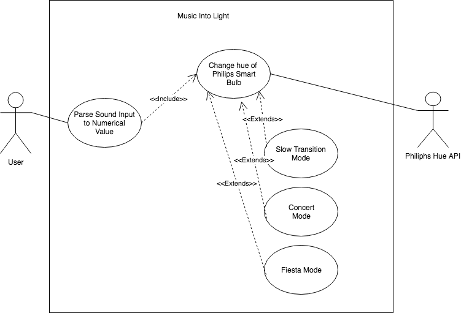

# Music into Light

## Project Abstract
The aim of this project is to create an application that can take sound and convert it into light. In order to take sound as an input we will be using the microphone built into the computer. We will also be using the Philips Hue smart bulb to create dynamic changes in light in-time to the music being played.

## Project Relevance
This project will require high levels of coordination between group members considering I only have one smart bulb (will consider buy a second or third myself). Testing would have to be done by whoever has the smart bulb in their physical possession at the time.

## Conceptual Design
In order to make this application work we would need to use the Philips Hue Api. We would take sound as an input and convert that to a value between 0 and 65535, which would be the value that the Hue Api uses to generate color for the lightbulb.

## Required Resources
- Group members
- Philips Hue Lightbulb (provided)
-Philips Hue API account
